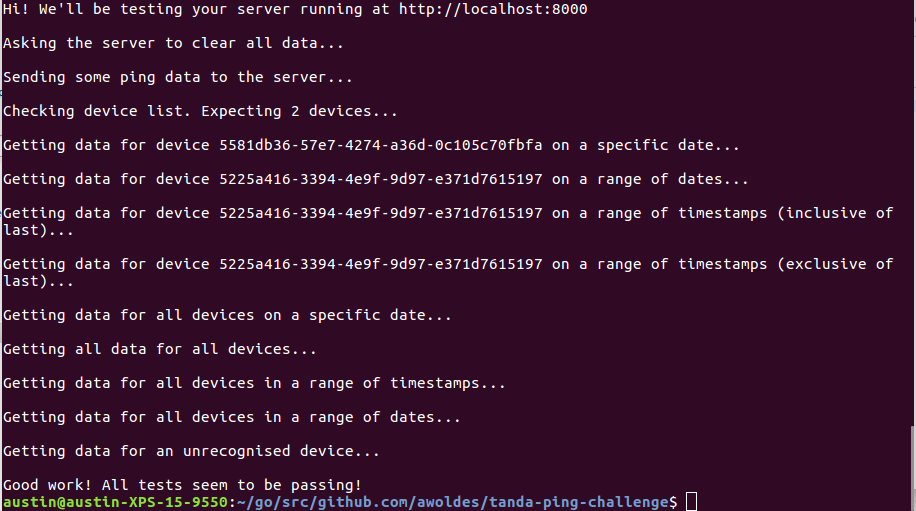

# tanda-ping-challenge
A solution to [Tanda's ping challenge](https://github.com/TandaHQ/work-samples/tree/master/pings%20(backend)) written in Go.

# Stack
- Golang (using this as an excersise to learn the language)
- MySQL

# Dependencies
- Mux: `go get github.com/gorilla/mux`
- Golang SQL driver: `go get -u github.com/go-sql-driver/mysql`
- godotenv: `go get github.com/joho/godotenv`

# To Run
- Set up a MySQL server running on `localhost:3306` that uses the sql dump found in this repo to create the database.
- Change user details in `main.go` to match the user connecting to the database.
- Create a `.env` file with the following inside: `DB_PASS=YOUR_PASSWORD`
- `./bin/tanda-ping-challenge`
- `ruby pings.rb`

# Tests Passing

